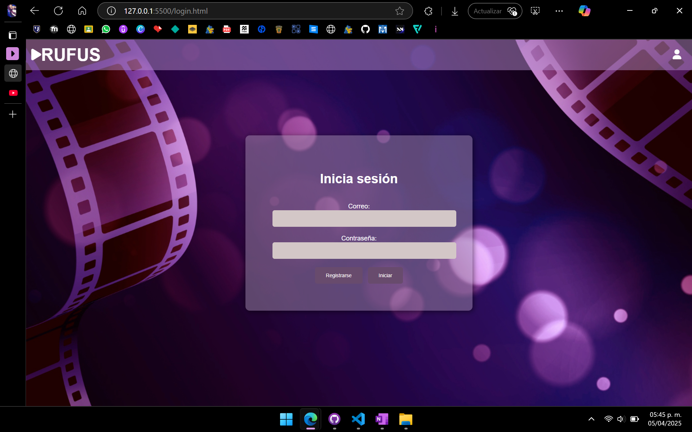
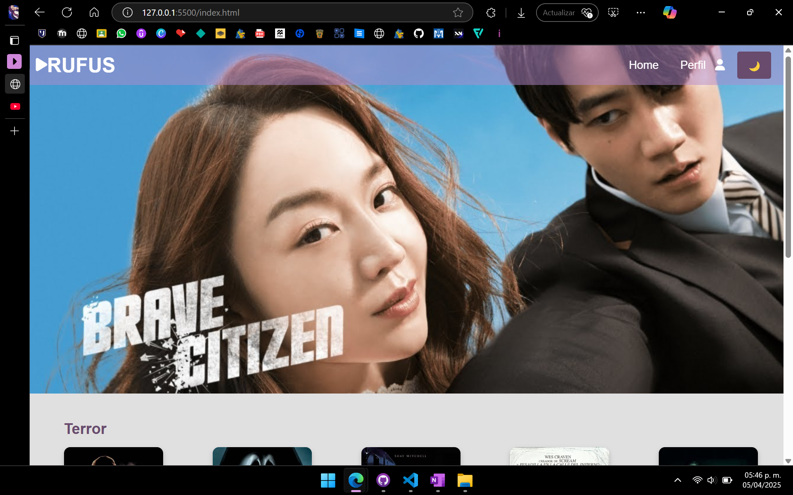
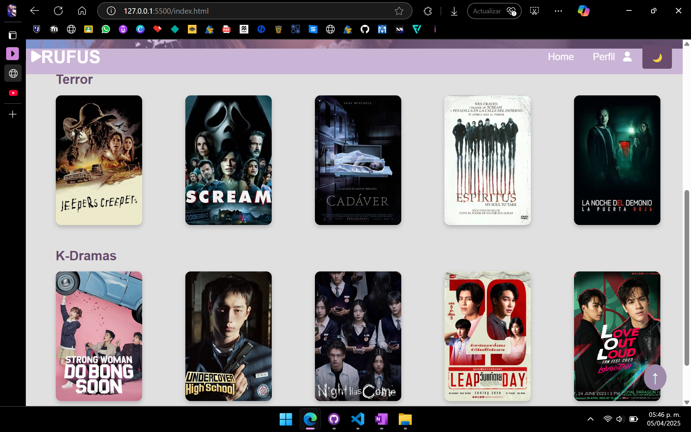
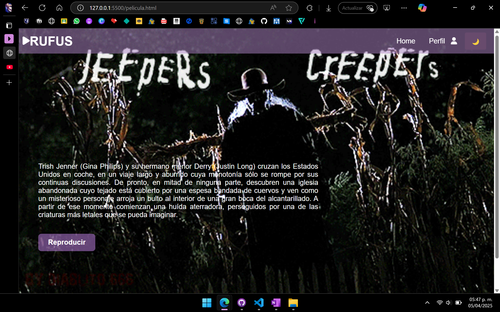
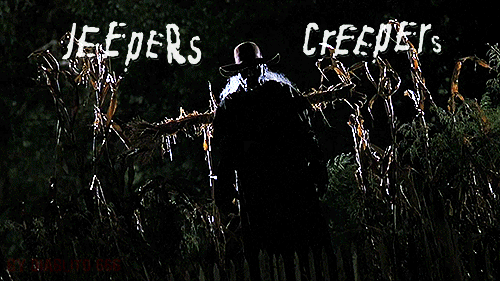

# RUFUS
## Descripcción
En esta plataforma de peliculas de nombre **RUFUS** se podrá encontrar contenido especialmente de terror y suspenso, así como también series k-drama, con tramas de acción y romance; en la parte superior del menú, se tendrá el botón de ***Home***, este para regresar al inicio, y el botón de ***Perfil*** que este permitirá cerrar sesión si así lo desea el usuario.
>La primera parte con la que te encontrarás será el inicio de sesión ('login.html'), en este deberás ingresar con un correo y contraseña, si en dado caso no se cuenta con uno, hay un botón que indica que ahí podrás registrarte, te redireccionará a un apartado con un formulario en el cual podrás realizar el registro para después iniciar sesión.
>Una vez iniciada sesión, se podrá acceder a la parte principal ('index.html'), en este aparecerá como portada la seríe o pelicula recién agregada o de estreno, que se actualiza cada semana, al bajar podrás encontrar como primera parte el pequeño catalogo de peliculas de terror, seguido de este están los k-dramas.
>Al seleccionar una pelicula, como podría ser la de Jeepers Creepers ('pelicula.html'), esta se redirecciona al apartado donde se encontrará una breve descripción de la misma, así como un boton que permitirá reproducir la pelicula.

## Imagenes 





## Mockup-Figma
https://www.figma.com/design/zWlRjQsRMXErpzbfVEQBsg/Mega?node-id=0-1&t=xFLk3VNHcsselJ2g-1

## Instrucciones
>Una vez descargado desde el mismo GitHub, se podría aplicar de la manera en que yo suelo hacerlo.
-Ingresar a GitHub Desktop y clonar el repositorio desde ahí, en la opción de añadir.
-Añadir directamente una vez descargado a nuestro _Disco Local (C:)_
├── Disco Local(C:)          
│   └── xampp
│        └── htdocs
En ese mismo orden y en esa ultima carptera para poder visualizarlo con la dirección de las carpetas desde el localhost. 

## Descripción del desarrollo
Primeramente realicé la maquetación para tener una idea clara de lo que buscaba realizar, una vez teniendo eso es más facil comensar.
Comencé con el login, considerando que esta sería la parte más sencilla de realizar, ya que unicamente es una imagen de fondo, y el pequeño formulario de inicio de sesión.

En los tres archivos utilicé el mismo formato para la barra de navegación
```html
 <ul class="nav">
      <li class="nav-item nav-left">
          <i class="fas fa-play"></i>
      </li>
      
      <li class="nav-item nav-title">
          <a href="index.html" class="nav-link-title">RUFUS</a>
      </li>
      
      <li class="nav-item nav-right">
        <a href="index.html" class="nav-link">Home</a>
      </li>

      <li class="nav-item nav-right perfil-dropdown">
        <span id="perfilBtn">Perfil <i class="fas fa-user"></i></span>
        <div id="menuPerfil" class="menu-perfil">
          <a href="login.html">Cerrar sesión</a>
        </div>
      </li>      

      <li class="nav-item nav-right">
        <button id="darkToggle" class="nav-link">🌙</button>
      </li>  
  </ul>
```

Archivo `login.html` con el siguiente contenido del formulario:
```html
 <!-- Contenido del formulario de inicio de sesión -->
    <div class="login-container">
        <h1 class="texto-login">Inicia sesión</h1>
            <form action="login.html" method="POST">
                <label for="email">Correo:</label>
                <input type="email" id="email" name="email">
                
                <label for="password">Contraseña:</label>
                <input type="password" id="password" name="password">
                
                <div class="button-container">
                    <button type="button">Registrarse</button>
                    <a href="index.html">
                        <button type="button">Iniciar</button>
                    </a>
                </div>
            </form>
    </div>
```

Para el 'index.html' usé el siguiente contenido y acomodo de la distribución de imagenes
```html
  <!-- Contenido principal -->
    <section class="contenido-index">
        
    </section>

    <section class="categoria">
      <h2>Terror</h2>
      <div class="grid-categorias">
          <a href="pelicula.html"></a>
          <a href="#"></a>
          <a href="#"></a>
          <a href="#"></a>
          <a href="#"></a>
      </div>
  </section>
  
  <section class="categoria">
    <h2>K-Dramas</h2>
      <div class="grid-categorias">
          <a href="#"></a>
          <a href="#"></a>
          <a href="#"></a>
          <a href="#"></a>
          <a href="#"></a>
      </div>
  </section>
```

Y para la última parte de la visualización de la 'pelicula.html' utilicé el siguiente contenidos
```html
        <section class="container-pelicula">
        <div class="fondo-gif">
            <div class="texto">
                <p>
                    Trish Jenner (Gina Philips) y su hermano menor Derry (Justin Long) cruzan los Estados Unidos en coche, en un viaje largo y aburrido cuya monotonía sólo se rompe por sus continuas discusiones. De pronto, en mitad de ninguna parte, descubren una iglesia abandonada cuyo tejado está cubierto por una espesa bandada de cuervos y ven como un misterioso personaje arroja un bulto al interior de una gran boca del alcantarillado. A partir de ese momento comienzan una huída aterradora, perseguidos por una de las criaturas más letales que se pueda imaginar.
                </p>
                <a href="https://youtu.be/hmKnm2jH_2Y?si=M8UmtavmgAYMJeAz" class="reproducir">Reproducir</a>
            </div>
            
            
        </div>
    </section>
```

Cabe memcionar que de igualmera repetí el mismo footer en el apartado de 'index.html' y 'pelicula.html'
```html
     <footer class="footer">
      <div class="footer-texto">
          Rufus Derechos reservados 2025
      </div>
      <div class="footer-redes">
          <a href="#"><i class="fab fa-facebook-f"></i></a>
          <a href="#"><i class="fab fa-twitter"></i></a>
          <a href="#"><i class="fab fa-instagram"></i></a>
      </div>
  </footer>
```

## Estrucutra del proyecto
Peliculas/
├── login.html                # Página principal con el login
├── index.html                # Apartado principal con el index y catalogo de peliculas
├── pelicula.html             # Página de la primer pelicula de Jeepers Creepers
├── scripts/
│   └── script.js             # Código de js donde están las funciones
├── styles/
│   └── style.css             # Estilos en css 

## Problemas conocidos
Como problemas que presenté, fueron principalmente en los botones, en el archivo de 'pelicula.html' al final de la descripción de la pelicula, no logré centrarlo acorde al texto.
Otro problema en cuestion a los botones fue en ese mismo archivo, en el menú superior en el apartado de Perfil, no me funcionó que el al momento de ser seleccionado este se desglozara y me diera la opción de _Cerrar Sesión_.

## Retrospectiva 
> _¿Qué hice bien?_ 
'''
Considero que en la parte del diseño me quedó tal cual como lo planteé en mi maquetación en figma, utilizando las mismas imagenes, los campos, los colores y los botones.
'''
>_¿Qué no salió bien?_
'''
Quizá tube algo de problemas en cuestión de los botones, ya que en mi apartado de 'pelicula.html' debajo de la descripción, donde aparece mi botón de <ins>Reproducir</ins> este no logré acomodarlo centrado al texto como hubiera querido.
También tube problemas con otro botón, en la misma parte de 'pelicula.html', en el menú superior, está la opción de perfil en unicamnete ahí en donde no realiza la función de desglozar la opción de _Perfil_.
'''
>_¿Qué puedo hacer diferente?_
'''
Me gustaría poder cambiar luego el formato completo, hacer un mejor diseño, acomodo de todo el contenido, agregar y mejorar el catalogo, agregar un apartado de busqueda y por categorias, un menú más atractivo y dinamico, agregar quizá algo de animación en la parte de atrás de la página. 
'''